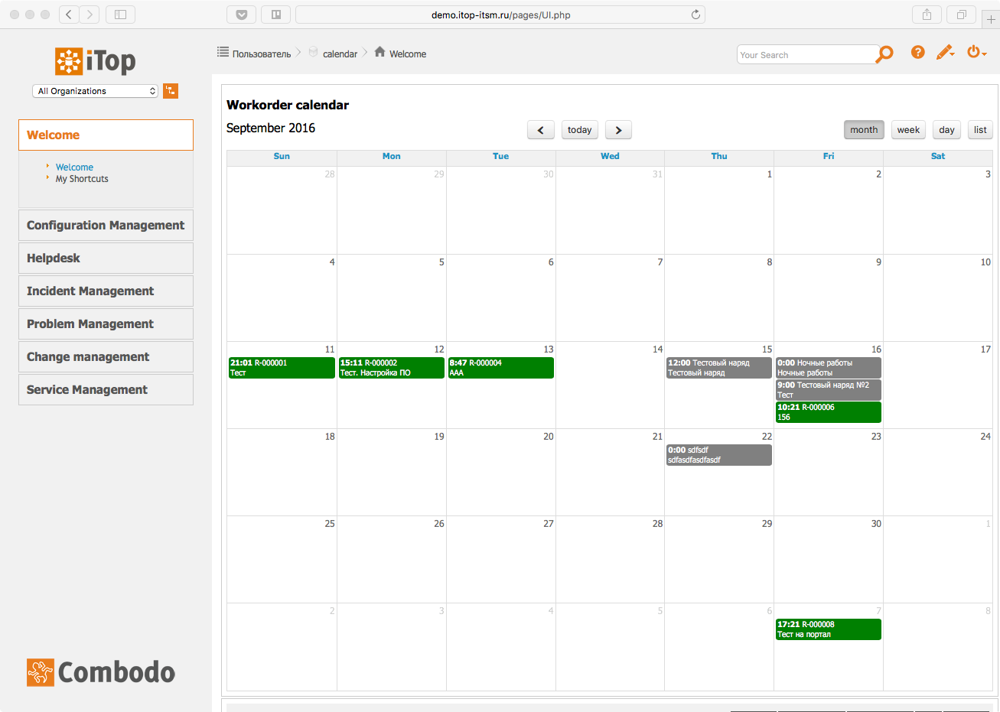
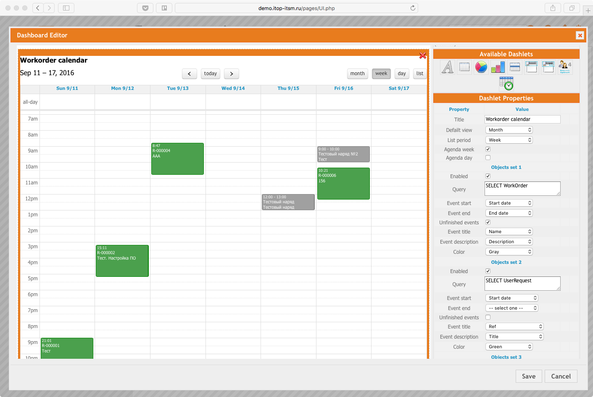

# Calendar for Combodo iTop

This module adds the awesome [FullCalendar](https://fullcalendar.io) dashlet to use in iTop dashboards and allows you to display on it an any object that has a date field.



## Installation

Install like any other extension. 

 - If you have ZIP downloaded extract and rename folder "dashlet-calendar-master" to "dashlet-calendar".
 - Copy "dashlet-calendar" folder to itop/extensions folder and go to http://localhost/setup/.
 - Select "Upgrade an existing iTop instance" and follow the wizard.

## Usage the calendar

Only a small part of FullCalendar functionality is implemented in the widget. Currently you can't add new events directly from the widget and use dragging to change dates. But it's planned in future releases. So stay tuned!

To add a new calendar open the dashboard editor and drag the calendar icon into a free space. Then you have to configure the calendar and save the dashboard. You can add several calendars on any dashboard.

Let's see what we have:



Here we have some general settings of the calendar and three separated sets of events. Each set of events may be configured independently of others. So you can display for example planned Changes, open Work Orders and Servers which have moved to production in this month in one calendar.

### Setting

General:
 - **Title** - header for the calendar
 - **Default view** - which view is used by default when the calendar is opened

View specific settings:
 - **List period** - time interval for a list view
 - **Agenda week** – use agenda for a week view
 - **Agenda day** - use agenda for a day view

Event set settings:
 - **Enabled** - turn on the event set
 - **Query** - OQL query to fetch objects to display
 - **Event start** - which date attribute of the queried object is used as the start of events
 - **Event end** - which date attribute of the queried object is used as the end of events
 - **Unfinished events** - display events for which end date is not filled yet; these events are shown as continuing to the present date (ex. unresolved Incidents)
 - **Event title** - which attribute is used as the title of events
 - **Event description** - which attribute is used as the description of events (second line, below the title)
 - **Color** - color for events of this set

### Configuration

You can change standard colors for events in the configuration file:
```
'dashlet-calendar' => array (
        'colors' => array (
          'blue' => '#006699',
          'cyan' => '#009999',
          'green' => '#009933',
          'red' => '#CC0000',
          'brown' => '#996633',
          'gray' => '#666666',
          'yellow' => '#CCCC00',
          'orange' => '#FF9900',
          'purple' => '#993366',
          'pink' => '#CC6699'
        ),
),
```

## Links
- [iTop ITSM & CMDB Russian Community](http://community.itop-itsm.ru)
- [FullCalendar](https://fullcalendar.io)
- [Combodo iTop](http://www.combodo.com/itop)
